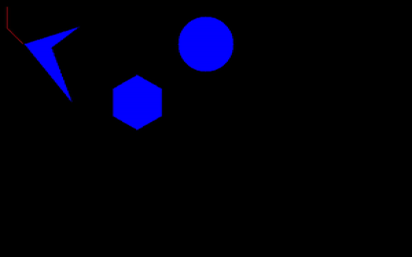

# Dijkstra_Pathfinding_Algorithm
```
Created by Akhilrajan Vethirajan as part of ENPM 661 course project at University of Maryland, USA. 
```

Dijkstra algorithm implemented to find a path for a wheeled mobile robot in a custom generated 2D map

## Steps to Run Program
1. Copy the python script into your system/virtual-environment.
2. Open the python script by double clicking on it.
3. Make sure all libraries required for the script are already installed in your system/virtual-env
4. Run the script from an IDE (recommended) / terminal
5. When prompted enter the X and Y coordinates of the Initial and Final position.

***Once the algorithm finds a possible path it will pull up a Dijstra window to show the algorithm implementation
A separate window shows the path found from the initial to goal coordinate.
Please note that the origin is in the top right corner.***



**--NOTE --**

**Might take some time to complete entire execution depending on the goal and initial node positions
If you do not want the exploration processs to be displayed comment them out**
